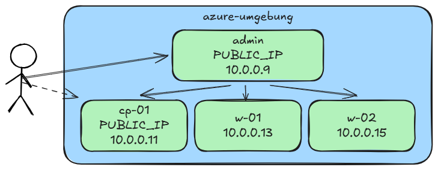

[← Zurück zur Übersicht](../../README.md)

# 01 Kubernetes Setup

In dieser ersten Aufgabe werden wir uns mit dem Setup eines Kubernetes-Clusters beschäftigen.
Hierbei wird zuerst die Control Plane aufgesetzt, welches die Grundkomponenten eines von Kubernetes beinhaltet.
Danach werden zwei weiter Worker-Knoten dem Cluster hinzugefügt.

Für diese sowie die nachfolgenden Übungen steht eine Umgebung bereit, mit mehreren virtuellen Maschinen.
Die folgende Abbildung zeigt die groben Details der Umgebung.
Über den Admin-Knoten, welcher mit einer öffentlichen IP konfiguriert ist, sind die für das Cluster über die angegebenen IPs erreichbar.



## Vorarbeit

Nutzten Sie das Werkzeug Ihrer Wahl (z. B. MobaXterm, Putty, VSCode), um sich mit dem Admin-Knoten Ihrer Umgebung zu verbinden.
Die Verbindungsinformationen sollten Ihnen bereits zur Verfügung stehen.
Das Basisbetriebssystem aller Knoten ist ein **RHEL 8**.

Machen Sie sich mit der Umgebung vertraut:
- Prüfen Sie die Version des Betriebssystems
- Haben Sie root Rechte?
- Sind die Cluster-Knoten erreichbar und können sie sich mit diesen verbinden?

## Das Setup

Beginnen Sie nun mit dem Setup auf dem vorgesehenen Knoten für die Control-Plane `cp-01`.
Verbinden Sie sich mit dem Knoten per SSH und führen Sie nacheinander die folgenden Schritte durch.

> Das Setup auf den Worker-Knoten ist mit den gleichen Schritten durchzuführen, nachdem die Control-Plane erfolgreich aufgesetzt ist.


### Node Setup

Die Konfiguration des Root-Dateisystems ist noch nicht optimal und kann ggf. dazuführen, dass kein Speicher mehr verfügbar ist.
Führen Sie die folgenden Befehle aus, um die entsprechenden Dateisysteme zu erweitern.

````bash
sudo lvextend --resizefs -L 5G /dev/mapper/rootvg-homelv
sudo lvextend --resizefs -L 15G /dev/mapper/rootvg-varlv
sudo lvextend --resizefs -L 15G /dev/mapper/rootvg-rootlv
sudo lvextend --resizefs -L 15G /dev/mapper/rootvg-usrlv
````


Für das weitere Setup machen wir es uns einfach und deaktivieren die interne Firewall des Betriebssystems.

> Dies sollte **niemals** auf einem Produktiv-System gemacht werden, sondern nur entsprechende Ports für den Betrieb einer Anwendung freigeben!
> Nutzen Sie die [offizielle Dokumentation](https://kubernetes.io/docs/reference/networking/ports-and-protocols/), um eine genaue Aussage zu machen, welche Ports freigeschaltet werden müssen.

````bash
sudo systemctl disable firewalld
sudo systemctl stop firewalld
````

Container, die von Kubernetes ausgeführt werden, haben je nach Einsatzzweck erweiterte Berechtigungen.
Damit diese von dem Sicherheits-System SELINUX nicht blockiert werden, muss dieses in einen auditiven Modus gesetzt werden.

````bash
sudo setenforce 0
sudo sed -i 's/^SELINUX=enforcing$/SELINUX=permissive/' /etc/selinux/config
````

Damit der Netzwerkverkehr die Pods bzw. Container erreicht, müssen weitere Module aktiviert und eine entsprechende Konfiguration vorgenommen werden.

> Die [offizielle Dokumentation bezüglich der Netzwerkkonfiguration](https://v1-31.docs.kubernetes.io/docs/setup/production-environment/container-runtimes/#network-configuration) aktiviert nur das *ipv4-forwarding*, jedoch sind je nach eingesetztem CNI-Plugin weitere Einstellungen nötig.

````bash
sudo modprobe overlay
sudo modprobe br_netfilter

cat << EOF | sudo tee /etc/sysctl.d/kubernetes.conf
net.bridge.bridge-nf-call-ip6tables = 1
net.bridge.bridge-nf-call-iptables = 1
net.ipv4.ip_forward = 1
EOF

sudo sysctl --system
````

Standardmäßig wird Kubelet nicht gestartet, wenn auf einem Knoten swap Speicher entdeckt wird.
Daher sollte swap auf allen Knoten deaktiviert werden.

````bash
# check if swap is used
free
# expected output: "swap:   0    0   0"
# disable swap:
swapoff -a
# vim /etc/fstab
````

### Container Runtime Setup

Nachdem die Grundkonfiguration des Betriebssystems abgeschlossen ist, folgt das Setup für die Container Runtime, welche für den Betrieb von Kubernetes unerlässlich ist.
In dem [Setup-Guide von Kubernetes.io für Container Runtimes](https://v1-31.docs.kubernetes.io/docs/setup/production-environment/container-runtimes/) werden verschiedene Werkzeuge gelistet, die das realisieren.
In diesem Setup nutzten wird das Docker-Repository und installieren das dort enthaltene containerd.io Paket und nutzten entsprechend containerd als Runtime.

Dem System das Docker-Repository bekannt machen.

````bash
sudo dnf install -y dnf-plugins-core
sudo dnf config-manager --add-repo https://download.docker.com/linux/rhel/docker-ce.repo
````

Installation der Container-Runtime auf den Cluster Knoten.
Es kann gerne auch docker installiert werden, es ist aber nicht erforderlich.

````bash
sudo dnf install -y containerd.io
# sudo dnf install -y docker-ce docker-ce-cli containerd.io docker-buildx-plugin docker-compose-plugin
# sudo systemctl enable --now docker
# sudo docker run hello-world
````

> **Hinweis:** In einer Aufgabe wollen wir mit Docker und einer Registry arbeiten, installiere daher Docker auf dem Admin-Knoten.


Erforderliche Konfiguration des CGroup Driver für Systemd Systeme für containerd vornehmen.

> Wurde diese Konfiguration nicht angewendet führt dies dazu, dass Pods bzw. Container nicht richtig Starten.

````bash
sudo cp /etc/containerd/config.toml /etc/containerd/config.toml.backup
containerd config default | sudo tee /etc/containerd/config.toml
sudo sed -e 's/SystemdCgroup = false/SystemdCgroup = true/g' -i /etc/containerd/config.toml
sudo systemctl restart containerd
````


### Kubernetes Toolset Setup

Die Container-Runtime ist installiert und läuft, es fehlt jetzt nur noch die Installation der Kubernetes-Tools und das Setup des Clusters.

Installation von Kubernetes Abhängigkeiten, welche nicht alle automatisch installiert werden.
````bash
sudo dnf install iproute-tc conntrack-tools.x86_64 socat -y
````

Das Repository der Pakete für Kubernetes dem System bekannt machen.

````bash
cat <<EOF | sudo tee /etc/yum.repos.d/kubernetes.repo
[kubernetes]
name=Kubernetes
baseurl=https://pkgs.k8s.io/core:/stable:/v1.31/rpm/
enabled=1
gpgcheck=1
gpgkey=https://pkgs.k8s.io/core:/stable:/v1.31/rpm/repodata/repomd.xml.key
exclude=kubelet kubeadm kubectl cri-tools kubernetes-cni
EOF
````

Installation der Kubernetes-Tools

````bash
sudo yum install -y kubelet kubeadm kubectl --disableexcludes=kubernetes
````

Automatisches Neustarten des Kubelet-Services einschalten

````bash
sudo systemctl enable kubelet
````

### Initialer Cluster Setup

Nachdem die Kubernetes Tools installiert sind, wird mit ``kubeadm init ...`` der initiale Control-Plane-Knoten initiiert.
In unserem Setup bekommt das Pod-Netzwerk und das Service-Netzwerk seinen definierten CIDR-Bereich mitgeteilt.
Die Ausgabe wird in ``kubeadm-init.out`` gespeichert.

````bash
cd ~
sudo kubeadm init --pod-network-cidr 192.168.64.0/18 --service-cidr 192.168.128.0/18 | tee kubeadm-init.out
````

Führe die abschließenden Schritte durch, damit der User Zugriff auf den Cluster erhält.

````bash
mkdir -p $HOME/.kube
sudo cp -i /etc/kubernetes/admin.conf $HOME/.kube/config
sudo chown $(id -u):$(id -g) $HOME/.kube/config
````


Damit das Cluster voll funktionsfähig wird, ist es notwendig, ein CNI-Plugin zu installieren.
Flannel, Calico, Cilium sind die bekanntesten, arbeiten jedoch unterschiedlich und benötigen ein bestimmtes Setup.

Nachfolgend wird Calico als CNI-Plugin installiert.
Da es jedoch für den Betrieb in einer Azure Umgebung angepasst werden muss, sind weitere Schritte nötig.

````bash
curl https://raw.githubusercontent.com/projectcalico/calico/v3.29.2/manifests/calico.yaml -O
cp calico.yaml vxlan-calico.yaml

# disable ipip mode and enable vxlan mode, mandatory for azure
# https://docs.tigera.io/calico/latest/networking/configuring/vxlan-ipip
sed -zi 's/            - name: CALICO_IPV4POOL_IPIP\n              value: "Always"/            - name: CALICO_IPV4POOL_IPIP\n              value: "Never"/' vxlan-calico.yaml
sed -zi 's/            - name: CALICO_IPV4POOL_VXLAN\n              value: "Never"/            - name: CALICO_IPV4POOL_VXLAN\n              value: "Always"/' vxlan-calico.yaml

kubectl apply -f vxlan-calico.yaml
````

### Worker Knoten hinzufügen

Nachdem auf cp-01 die Control-Plane mit den Cluster-Komponenten läuft, können weitere Knoten hinzugefügt werden.
In unserem Falle sind das zwei weitere Worker-Knoten.
Führe die Setup-Schritte bis zum ``Kubernetes Toolset Setup`` durch, nutze danach den ``kubeadm join ...`` Befehl aus der ``kubeadm-init.out`` Datei.


## Cluster Upgrade

Ein wichtiger Prozess ist es, den Cluster aktuell zu halten.
Kubernetes versorgt nur die letzten 3 Versionen mit Updates, sollte eine Version abgekündigt sein, muss man entsprechend handeln und seinen Cluster upgraden.
Im Setup haben wir die Version 1.31 installiert, da es bereits die Version 1.32 gibt, wollen wir das Cluster auf diese Version aktualisieren.


### Upgrade Control-Plane

In der ersten Phase werden zuerst alle Control-Plane-Knoten aktualisiert.

Mit ``kubectl drain ...`` den Knoten "virtuell" aus dem Cluster herausnehmen.
Dabei werden mögliche Workloads auf andere Knoten verdrängt und den Cluster-Knoten für zukünftige Workloads vom Scheduling herausgenommen
````bash
kubectl drain cp-01 --ignore-daemonsets
````

Da die Kubernetes-Konfiguration fest auf 1.31 konfiguriert ist, muss diese entsprechend angepasst werden.
Beide Versions-Referenzen in der Datei auf ``1.32`` anheben.
````bash
sudo vim /etc/yum.repos.d/kubernetes.repo
````

Danach kann man sich ansehen, welche Versionen verfügbar sind und auf eine bestimmte Version wechseln oder einfach die letzte Version nehmen.
````bash
sudo yum --showduplicates --disableexcludes=kubernetes list kubeadm kubelet
sudo yum update --disableexcludes=kubernetes kubeadm kubelet
````

Nachdem die neuen Tools verfügbar sind, gilt es, die Cluster-Komponenten auf dem Knoten an sich upzugraden.
Ausgabe der ``kubeadm upgrade plan`` beachten und auf die gezeigte Version für das apply verwenden.
````bash
sudo kubeadm upgrade plan
sudo kubeadm upgrade apply <VERSION>
````

Prüfen, welche Version noch im Cluster für cp-01 noch angezeigt wird.
````bash
kubectl get nodes
````

Das Upgrade ist noch nicht ganz abgeschlossen, zuerst müssen noch Systemd aktualisiert und der kubelet-Service (`kubelet.service`) neu gestartet werden.
Danach ist die Version im Cluster ersichtlich und das Upgrade auf dem Knoten ist "abgeschlossen".
````bash
sudo systemctl daemon-reload
sudo systemctl restart kubelet.service
kubectl get nodes
````

> **Hinweis:** bei einem Test wurden ``kubectl`` Befehle mit Fehler, aufgrund unpassender Berechtigungen, abgebrochen.
> Ein erneutes laden der ``KUBECONFIG`` hat Abhilfe geschaffen.
>
> ````bash
> sudo cp -b /etc/kubernetes/admin.conf .kube/config
> sudo chown student:student .kube/config
> ````
>

Jedoch wird der Knoten im Cluster immer noch als ``unschedulable`` markiert.
Damit Workloads wieder auf dem Knoten laden können, muss die virtuelle Sperre wieder mit ``kubectl uncordon ...` rückgängig gemacht werden.
````sh
kubectl uncordon cp-01
````


### Upgrade Worker

Nachdem das Upgrade für die Control-Plane erfolgreich abgeschlossen ist, kann mit den Worker-Knoten der Upgrade-Prozess fortgeführt werden.
Der Prozess ist äquivalent zu Control-Plane auszuführen, jedoch mit der Ausnahme, dass lediglich ein ``kubeadm upgrade node`` ausgeführt wird.
Nachfolgend sind entsprechend die Schritte aufgelistet.

````sh
# evict pods from node, make node unschedulable
kubectl drain w-0X --ignore-daemonsets
# connect to node
ssh w-0X

# update kubernetes tools
sudo vim /etc/yum.repos.d/kubernetes.repo
sudo yum update -y --disableexcludes=kubernetes kubeadm kubelet
# upgrade kubernetes components
sudo kubeadm upgrade node
# reload systemd and restart kubelet.service
sudo systemctl daemon-reload
sudo systemctl restart kubelet.service

# make node schedulabe again
kubectl uncordon w-0X
````
