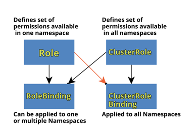
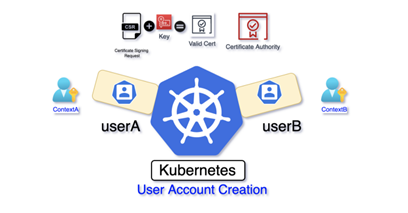

[← Zurück zur Übersicht](../../../README.md)

# 08 - Übungen RBAC
In dieser einfachen Übung soll der grundlegende Umgang bzw. Erstellung mit RBAC gezeigt werden.
RBAC in Kubernetes wird durch 4 Objekte definiert:

- Role
- ClusterRole
- RoleBinding
- ClusterRoleBinding

**Beachten Sie Folgendes:**
Berechtigungen sind rein additiv, d.h. ein Benutzer kann eine oder mehrere Rollen in Anspruch nehmen.
Es gibt keine "Deny"-Regeln, so dass Sie nur angeben, was innerhalb der Rolle erlaubt ist, alles andere wird verweigert.
Subjekte (Benutzer, Gruppen, Dienstkonten), die die Rolle clusterRole haben, erhalten Zugriff auf aktuelle und zukünftige Ressourcen mit und ohne Namensraum.




Wir demonstrieren die Anwendung von 2 verschiedenen Rollen auf 2 verschiedene Benutzer auf der Grundlage der Zugriffsart (read-only oder read-write) in verschiedenen Namensräumen, dann die Anwendung der ClusterRole auf einen anderen Benutzer und die Überprüfung des Zugriffs für jeden mit "auth can-i".

## Getting Started

Lassen Sie uns starten mit der Übung.

Erster Schritt: Namespace erstellen

````sh
kubectl create ns dev
kubectl create ns staging
````

Erstellen Sie in den Namespaces dev und staging die Rollen read-only und read-write wie folgt:

````sh
kubectl -n dev create role read-only --verb=get,watch,list --resource='*'
kubectl -n dev create role read-write --verb=get,watch,list,create,update,patch,delete --resource='*'
kubectl -n staging create role read-only --verb=get,watch,list --resource='*'
kubectl -n staging create role read-write --verb=get,watch,list,create,update,patch,delete --resource='*'
````

Beachten Sie, dass die Nur-Lese-Rolle Berechtigungen (get,watch,list) enthält, während die Lese-Schreib-Rolle Berechtigungen (get,watch,list,create,update,patch,delete) enthält.

## RoleBinding

Lassen Sie uns nun diese Rollen wie folgt verwenden und sie mit dem entsprechenden Benutzer (dev-user und staging-user) verknüpfen:

````sh
kubectl -n dev create rolebinding dev-rb --role=read-write --user=dev-user
kubectl -n staging create rolebinding staging-rb --role=read-write --user=staging-user
kubectl -n staging create rolebinding dev-rb --role=read-only --user=dev-user
kubectl -n dev create rolebinding staging-rb --role=read-only --user=staging-user
````

In diesem Fall geben wir also dem dev-user Lese- und Schreibzugriff im dev-Namensraum und dem staging-user Lese- und Schreibzugriff im staging-Namensraum.
Außerdem werden wir jedem Benutzer nur Lesezugriff auf den anderen Namensraum gewähren.


## Testen mit auth-can-i

Testen wir nun diese Rollen mit "auth can-i

````sh
kubectl -n dev auth can-i get pods --as dev-user
kubectl -n dev auth can-i create pods --as dev-user
kubectl -n staging auth can-i create pods --as dev-user
kubectl -n staging auth can-i list pods --as dev-user
kubectl -n staging auth can-i list pods --as staging-user
kubectl -n staging auth can-i create pods --as staging-user
kubectl -n dev auth can-i create pods --as staging-user
````

Wie Sie sehen, kann dev-user Pods im dev-Namensraum abrufen und erstellen und kann nur Pods im staging-Namensraum auflisten, aber keinen Pod im staging-Namensraum erstellen. Es funktioniert also wie erwartet!!

## Erstellen von ClusterRole und ClusterRoleBinding

Lassen Sie uns nun eine ClusterRole erstellen, die auf Ressourcen (Deployments und Pods) angewendet wird, und diese dann dem Benutzer "deployer-user" zuordnen.
````sh
kubectl create clusterrole deployer --verb=get,watch,list,create,update,patch,delete --resource=deployments,pods
kubectl create clusterrolebinding deployer-crb --user deployer-user --clusterrole deployer
````
Testen wir diese ClusterRole mit 'auth can-i'

````sh
kubectl -n staging auth can-i list pods --as deployer-user
kubectl -n staging auth can-i list secrets --as deployer-user
kubectl -n dev auth can-i list pods --as deployer-user
kubectl -n dev auth can-i update deployments --as deployer-user
kubectl -n dev auth can-i list secrets --as deployer-user
kubectl -n staging auth can-i list secrets --as deployer-user
kubectl -n staging auth can-i delete pods --as deployer-user
````
Wie Sie sehen, hat der Deployer-Benutzer in der ClusterRolle den erwähnten Zugriff auf Deployments und Pods-Ressourcen über Namespaces hinweg.

## User Context anlegen

Jetzt könnten Sie noch ein entspr. Benutzer in Linux anlegen (zB deployer-user) und dann testen, was erstellt werden kann bzw. es verboten ist. Oder über entspr. Context / Config – Einstellungen wechseln.



### User Zertifikat generieren

Wir beginnen mit der Generierung eines Schlüssels und verwenden diesen Schlüssel, um eine CSR "Certificate Signing Request" zu erstellen (siehe unten).
Denken Sie daran, Common name-CN gleich dem Benutzernamen einzugeben, in unserem Fall also ``dev-user``:

````sh
openssl genrsa -out dev-user.key 2048
openssl req -new -key dev-user.key -out dev-user.csr
````

Jetzt müssen wir diese CSR in eine CSR-Kubernetes-Ressource umwandeln, um sie über die Kubernetes-API genehmigen zu können, und dann das eigentliche Zertifikat für die Benutzerauthentifizierung daraus generieren.
Suchen Sie in der Kubernetes-Dokumentation nach dem YAML-Körper der Ressource "Certificate Signing Request".
Sie werden etwas ähnliches wie das folgende YAML erhalten.

````yaml
apiVersion: certificates.k8s.io/v1
kind: CertificateSigningRequest
metadata:
  name: dev-user
spec:
  request: VALUE
  signerName: kubernetes.io/kube-apiserver-client
  expirationSeconds: 86400  # one day
  usages:
  - client auth
````

Hinweise:
- ***expirationSeconds*** könnte länger (z. B. 864000 für zehn Tage) oder kürzer (z. B. 3600 für eine Stunde) sein
- ***request*** ist der base64-kodierte Wert des Inhalts der CSR-Datei.

Der WERT kann also wie folgt berechnet werden:
````sh
cat dev-user.csr | base64 | tr -d "\n"
````
Die Ausgabe des vorherigen Befehls kopieren Sie und ersetzen damit den „Value“ im obigen yaml – file (csr.yaml)

Als nächstes aktivieren Sie diesen Signing Request:
````sh
kubectl apply -f csr.yaml
````
Zur Überprüfung des csr:
````sh
kubectl get csr
````
Der Status des csr sollte „pending“ sein.
Als nächsten Schritt dann die Anfrage genehmigen:
````sh
kubectl certificate approve dev-user
````
Rufen Sie nun die YAML-Darstellung der CSR ab, um das eigentliche Zertifikat anzuzeigen:
````sh
kubectl get csr -o yaml
````
Dann müssen Sie dieses Zertifikat dekodieren, um das tatsächlich verwendbare Zertifikat zu erhalten, was mit dem base64-Befehl wie unten geschehen kann:

````sh
kubectl get csr dev-user -o jsonpath={.status.certificate} | base64 -d > dev-user.crt
````

Das finale Certificate wird nun im file dev-user.crt abgespeichert.

### User Conext Konfiguration anlegen

Dann bearbeiten wir die Authentifizierungskonfiguration, um einen Eintrag für den dev-user mit dem benötigten Schlüssel und Zertifikat hinzuzufügen:

````sh
kubectl config set-credentials dev-user --client-key=dev-user.key --client-certificate=dev-user.crt
````

Sehen wir uns nun die kube-Konfigurationsdatei an, die die Authentifizierungskriterien für verschiedene Benutzer beschreibt, um sicherzustellen, dass dev-user korrekt konfiguriert ist:

````sh
kubectl config view
````

Standardmäßig liest dieser Befehl aus der Konfigurationsdatei im Verzeichnis ``$HOME/.kube``.
Als Anzeige sollten Sie nun die Infos zu dem dev-user sehen im config – file.
Mit der Option ``--embed-certs`` Zertifikat und Key direkt in die KubeConfig einzufügen und nicht nur als Referenz anzugeben.

````sh
kubectl config set-credentials dev-user --client-key=dev-user.key --client-certificate=dev-user.crt --embed-certs
kubectl config view
````

Testen wir nun unseren Benutzer "dev-user" mit der ihm zugewiesenen Rollen.
Denken Sie daran, dass dev-user im dev-Namensraum Lese- und Schreibzugriff und im staging-Namensraum nur Lesezugriff hat.
Den entsprechenden Context erstellen und setzen wie folgend:
````sh
kubectl config set-context dev-user --namespace dev --user dev-user --cluster kubernetes
kubectl config use-context dev-user
````
Und einen Pod erstellen:
````sh
kubectl run nginx --image=nginx -n dev
````
Dies sollte erfolgreich sein.
Wenn wir jedoch versuchen, einen Pod im Staging-Namespace zu erstellen, sollte dies wie folgt fehlschlagen:
````sh
kubectl run nginx --image=nginx -n staging
````
## Nicht vergessen!!!

Nach dem Beenden der Übung den Context wieder zurücksetzen ```kubectl config use-context kubernetes-admin@kubernetes```

## Cleanup
```bash
# deletes also roles and rolebindings in respected namespaces
kubectl delete namespaces dev staging
kubectl delete clusterrole deployer
kubectl delete clusterrolebindings.rbac.authorization.k8s.io deployer-crb
kubectl config delete-user dev-user
kubectl config delete-context dev-user
```
