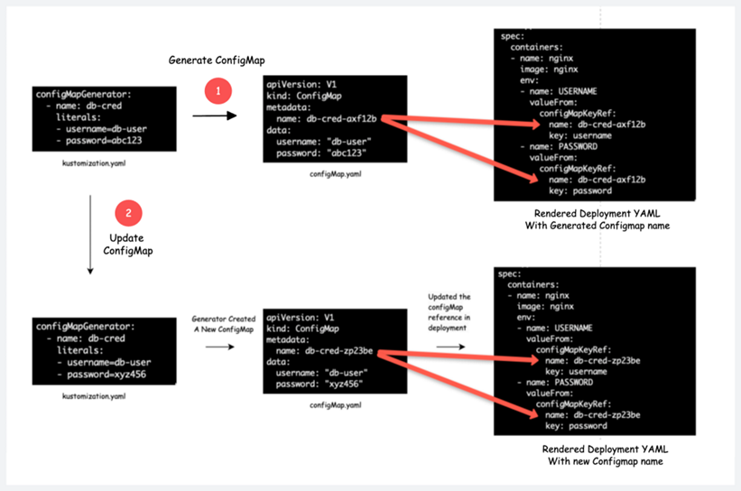

[← Zurück zur Übersicht](../../../../README.md)

# Übung Kustomize

In dieser Übung möchten wir uns mit Kustomize beschäftigen und die grundlegenden Konzepte betrachten.
Das Beispiel umfasst die ein *base*-Verzeichnis, welches die Grundlegenden Ressourcen beinhaltet.
In zwei Overlay-Verzeichnissen (*dev* und *prod*) sind zwei unterschiedliche Ausprägungen der Manifeste definiert.
Das Beispiel beinhaltet ein Deployment sowie ein Service, je nach Overlay werden die Manifeste etwas verändert und im Cluster angewendet.
In realen Projekt ist das YAML komplexer und zudem sind mehrere Objekte und mehr Einsatzumgebungen definiert.

Das Szenario ist wie folgende definiert.
1. Der Nginx-Webserver muss in der Entwicklungs- und Produktionsumgebung bereitgestellt werden.
2. In der Entwicklung benötigen wir nur eine Deployment mit 2 Replikaten, einem Nodeport-Service und weniger Arbeitsspeicher und CPU-Ressourcen.
3. In *prod* benötigen wir eine Deployment mit 4 Replikaten, unterschiedlichen CPU- und Speicherlimits, einer fortlaufenden Update-Strategie und einem Service ohne NodePort.


Die Verzeichnisstruktur ist gegeben und sieht entsprechend so aus:
```
kustomize
│
├── base
│   ├── deployment.yaml
│   ├── service.yaml
│   └── kustomization.yaml
│
└── overlays
    ├── dev
    │   ├── deployment-dev.yaml
    |   ├── service-dev.yaml
    │   └── kustomization.yaml
    │
    └── prod
        ├── deployment-prod.yaml
        ├── service-prod.yaml
        └── kustomization.yaml
```

Machen Sie sich mit der gegebenen Struktur und den Manifesten vertraut.
- Wie wird in den ``kustomization.yaml`` referenziert?
- Wie wird eine Änderung in den Overlays in den ``kustomization.yaml`` angegeben?

## Ausrollen der Manifeste

Nachdem wir nun die Basis- und Overlay-Manifeste bereit haben, werden wir es mit Kustomize bereitstellen.

### Ausrollen von dev
Vor dem Ausrollen in den Cluster kann man sich nochmal vergewissern, ob die angewendeten Patches richtig sind und alle erwarteten Manifeste aufgelistet sind.

````bash
# kubectl
kubectl kustomize overlays/dev
# kustomize
kustomize build overlays/dev
````

Mit dem Ausführen wird je nach aktuellem Overlay ein komplettes Manifest gerendert, mit allen enthaltenen Ressourcen.

Mit ``kubectl`` lässt sich das  angepasste Manifest im Cluster bereitstellen:

````bash
# kubectl
kubectl apply -k overlays/dev
# kustomize
kustomize build overlays/dev | kubectl apply -f -
````

Nach der Bereitstellung können wir die Objekte überprüfen.
- Sind alle erwarteten Pods, Deployments und Services vorhanden?
- Sind die Einstellungen wie erwartet?

### Ausrollen von prod

Im nächsten Schritt wollen wir die Ressourcen des prod-Overlays ausrollen.
- Was würde passieren, wenn man es direkt ausrollt?

Um entsprechend des Overlays auf den richtigen Objekten zu agieren, kann man zum Beispiel ein Namespace nutzen.
Fügen sie ``namespace: prod`` in ``overlays/prod/kustomization.yaml`` ein.

Führen Sie den kustomize-Befehl auf das Prod-Overlay aus, um es im Cluster auszurollen.
- Was passiert und was ist noch zu machen?
- Was könnte man im Prod-Overlay einfügen und anpassen, damit der Fehler nicht mehr auftritt?


## Secret- und Configmap-Generatoren

Bevor wir uns ansehen, wie ein Secret/Config-Generator funktioniert, wollen wir verstehen, welches Problem er löst.
Wenn Sie eine Configmap, die als Volume an einen Pod angehängt ist, aktualisieren, werden die Configmap-Daten automatisch an den Pod weitergegeben.

In den folgenden Szenarien erhält der Pod jedoch nicht die neuesten Daten in der Konfigurationszuordnung.
1. Wenn der Pod Umgebungsvariablen aus der configmap abruft.
2. Wenn die Konfigurationszuordnung als Volume mit einem Unterpfad gemountet wird.

In den oben genannten Fällen verwendet der Pod weiterhin die alten ConfigMap-Daten, bis wir den Pod neu starten.
Weil der Pod nicht weiß, was in der ConfigMap geändert wurde.
Im Wesentlichen werden die Daten aus den ConfigMaps (z. B. Eigenschaften, Umgebungsvariablen usw.) von Anwendungen während ihres Starts verwendet.
Selbst wenn die aktualisierten ConfigMap-Daten auf den Pod projiziert werden, müssen Sie den Pod neu starten, damit die Änderungen wirksam werden, wenn die Anwendung, die im Pod ausgeführt wird, nicht über einen Hot-Reload-Mechanismus verfügt.

Welche Möglichkeiten haben wir, um dieses Problem zu lösen?
1. Sie können den Reloader-Controller verwenden.
2. Verwenden des Kustomize-ConfigMap-Generators

Wenn Sie Kustomize bereits für Kubernetes-Bereitstellungen verwenden oder planen, es zu verwenden, sind keine zusätzlichen Controller erforderlich, um sich um ConfigMap-Rollouts zu kümmern. In den folgenden Themen sehen wir uns an, wie Sie ConfigMap- und Secret-Generatoren verwenden.

### Funktionsweise

1. Der Kustomize-Generator erstellt eine ConfigMap und ein Secret mit einem eindeutigen Namen (Hash) am Ende. Wenn der Name der Configmap z. B. app-configmap lautet, hat die generierte Configmap den Namen app-configmap-7b58b6ct6d. Hier ist 7b58b6ct6d der angehängte Hash.
2. Wenn Sie die ConfigMap/Secret aktualisieren, wird am Ende eine neue ConfigMap/Secret mit demselben Namen und einem anderen Hash (zufällige Zeichensätze) erstellt.
3. Kustomize aktualisiert die Bereitstellung automatisch mit dem neuen configmap-Namen.
4. In dem Moment, in dem die Bereitstellung von Kustomize aktualisiert wird, wird ein Rollout ausgelöst und die Anwendung wird auf dem Pod ausgeführt und ruft die aktualisierten configmap/secret-Daten ab. Auf diese Weise müssen wir die Bereitstellung nicht erneut bereitstellen oder neu starten.


Die folgende Abbildung zeigt den Workflow zum Erstellen und Aktualisieren von Configmaps mit Änderungen am Hash während der Erstellungs- und Aktualisierungsphasen.



Im Folgenden finden Sie die wichtigen Punkte, die Sie über die Kustomize-Generatoren wissen sollten.

1. Da Kustomize jedes Mal eine neue ConfigMap erstellt, wenn es ein Update gibt, müssen Sie Ihre alten verwaisten ConfigMaps sammeln.
Wenn Sie Ressourcenkontingentgrenzen für den Namespace festgelegt haben, können verwaiste Configmaps ein Problem darstellen.
Oder Sie sollten das Flag ``–prune`` mit Beschriftungen im Befehl ``kubectl apply`` verwenden.
Außerdem bieten GitOps-Tools wie ArgoCD Mechanismen zur Überwachung verwaister Ressourcen.
2. Sie können das Flag ``disableNameSuffixHash: true`` verwenden, um das Erstellen neuer Configmaps bei jedem Update zu deaktivieren, aber es löst keinen Pod-Rollout aus.
Sie müssen manuell einen Rollout für Pods auslösen, um die neuesten ConfigMap-Daten abzurufen.
Oder die Anwendung, die im Pod ausgeführt wird, sollte über einen Hot-Reload-Mechanismus verfügen.


### Generators Overlay

Schauen wir uns nun praktisch an, wie man einen ConfigMapGenerator.

Machen Sie sich mit den Dateien im Verzeichnis ``overlays/generators/`` vertraut.
- In welchen Namespace wird deployt? Erstellen Sie diesen, falls es ihn noch nicht gibt.
- Welche Labels werden an die ConfigMap angefügt ([generatorOptions](kustomize-ref-generatorOptions))?
- Wie wird die erstellte ConfigMap von dem Deployment verwendet?

````
└── overlays/
    ├── dev/
    │
    ├── generators/
    │   ├── deployment.yaml
    │   ├── files/
    │   │   └── index.html
    │   ├── kustomization.yaml
    │   └── service.yaml
    │
    └── prod/
````

Wenden Sie das Overlay auf den Cluster an (``kubectl apply -k ...``) und überprüfen Sie die erstellten Ressourcen.
- Sind alle Ressourcen wie erwartet vorhanden?
- Hat sich evtl. etwas an dem Manifest des Deployments verändert im Vergleich zur Vorlage?
- Was erhalten Sie bei einem curl auf den Cluster mit der NodePort aus dem generator-Namespace?

Die ``generatorOptions`` hat die Einstellung ``disableNameSuffixHash``.
- Was macht die Einstellung bzw. testen Sie es mit einem erneuten ``kubectl apply ...`` aus, nachdem Sie die Einstellung geändert haben.
- Setzten Sie am Ende die Einstellung wieder auf ``false`` und rollen das Overlay aus.

Machen Sie mehrmals eine Änderung in der Datei ``overlays/generators/files/index.html`` und wenden Sie jede Änderung an.
- Was fällt bei den ConfigMaps auf?
- Wie kann man das verhindern? (Siehe oben)

## Cleanup

```bash
kubectl delete -k overlays/dev
kubectl delete -k overlays/generators
kubectl delete -k overlays/prod
kubectl delete namespaces generators prod
```

## Referenzen

- [Kustomize - Kustomization File][kustomize-ref-kustomizationfile]
- [Kustomize - GeneratorOptions][kustomize-ref-generatorOptions]
- [StackState - Orphaned Resources in Kubernetes][stackstate-orphaned-resources-in-kubernetes]

[kustomize-ref-kustomizationfile]: https://kubectl.docs.kubernetes.io/references/kustomize/kustomization/
[kustomize-ref-generatorOptions]: https://kubectl.docs.kubernetes.io/references/kustomize/kustomization/generatoroptions/

[stackstate-orphaned-resources-in-kubernetes]: https://www.stackstate.com/blog/orphaned-resources-in-kubernetes-detection-impact-and-prevention-tips/
