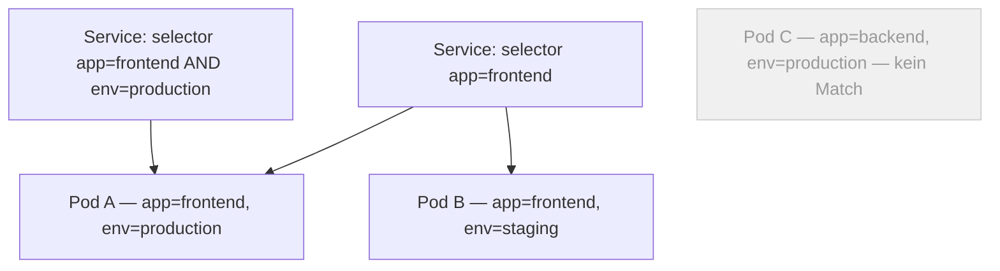

# Labels & Selectors

## Zweck

Labels verknüpfen Ressourcen miteinander. ohne feste Verdrahtung. Ein Service findet seine Pods nicht über Namen, sondern über Labels. Das macht alles flexibel: Pods kommen und gehen, der Service bleibt gleich.

---

## Wo werden Labels definiert?

Direkt im YAML der Ressource, unter `metadata.labels`:

```yaml
# z.B. in einem Pod oder Deployment
metadata:
  name: mein-pod
  labels:
    app: frontend      # selbst gewählter Key: Value
    env: production
```

> Labels kannst du auf **jeden** Kubernetes-Objekt setzen — Pod, Deployment, Service, Node…

---

## Eigenschaften

- Frei wählbar — kein fixes Schema
- Reine Metadaten, kein Einfluss auf das Verhalten
- Änderungen wirken sofort — verliert ein Pod ein Label, fällt er aus dem Service heraus

---

## Selectors

Ein Selector sagt: _"Gib mir alle Objekte mit diesen Labels."_

```yaml
# z.B. in einem Service
selector:
  app: frontend
  env: production
# → trifft nur Pods die BEIDE Labels haben
```

Mehrere Kriterien = **AND** — alle müssen passen.

---

## Wie es zusammenhängt



> Pod C hat keinen passenden Selector — wird von keinem Service angesprochen.

---

## Wo werden Selectors verwendet?

|Ressource|Wozu|
|---|---|
|`Service`|Traffic zu den richtigen Pods routen|
|`Deployment`|Welche Pods zum Deployment gehören|
|`NetworkPolicy`|Firewall-Regeln für bestimmte Pods|
|`Node Affinity`|Pods auf bestimmte Nodes schedulen|

---

## Zwei Arten von Selectors

```yaml
# Einfach — exakter Match
selector:
  matchLabels:
    app: frontend

# Flexibler — mit Operatoren
selector:
  matchExpressions:
    - key: env
      operator: In          # In / NotIn / Exists / DoesNotExist
      values: [production, staging]
```