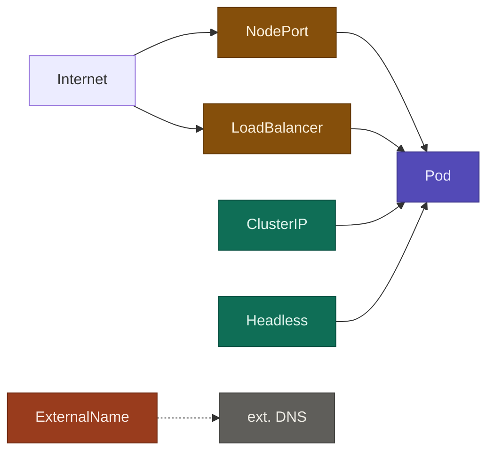
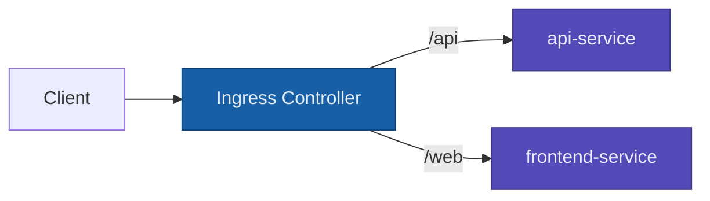
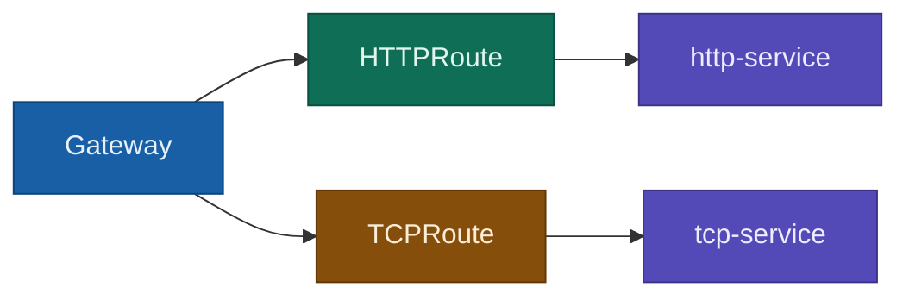
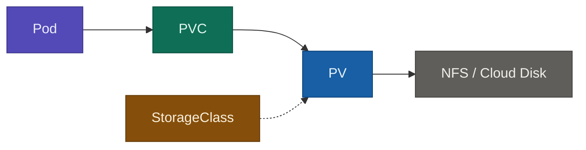
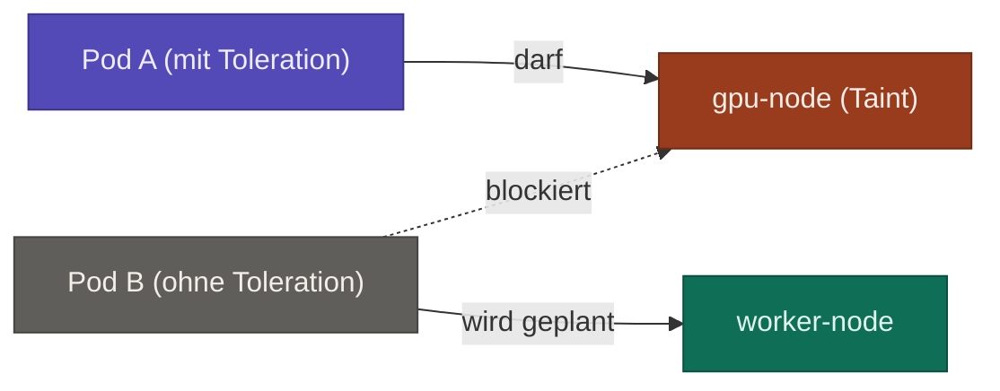

## ConfigMaps & Secrets

> Kubernetes-Objekte zum Speichern von Konfigurationsdaten, getrennt vom Container-Image.

| Typ           | Zweck                              | Beispiel             |
| ------------- | ---------------------------------- | -------------------- |
| **ConfigMap** | Normale Konfigurationswerte        | URLs, Feature-Flags  |
| **Secret**    | Sensitive Daten (Base64-encodiert) | Passwörter, API-Keys |

Beide können in Pods eingebunden werden als:

- **Umgebungsvariablen** (`env:`)
- **Gemountete Dateien** (`volumeMounts:`)

---

## Services

> Services machen Pods erreichbar — intern oder extern. Pods haben wechselnde IPs, Services sind stabil.

### Service-Typen



### ClusterIP (Standard)

- Nur **intern** im Cluster erreichbar
- Pods sprechen sich untereinander damit an

### Headless Service

- Wie ClusterIP, aber **ohne virtuelle IP** (`clusterIP: None`)
- Kubernetes gibt direkt die **Pod-IPs** per DNS zurück
- Nützlich für StatefulSets (z.B. Datenbanken)

### NodePort

- Öffnet einen Port (`30000–32767`) auf **jedem Node**
- Von aussen erreichbar via `NodeIP:NodePort`
- Einfach, aber nicht für Produktion empfohlen

### LoadBalancer

- Erstellt eine **externe IP** über den Cloud-Provider (AWS, GCP, Azure)
- Intern baut es auf NodePort auf

### ExternalName

- Kein echter Service — nur ein **DNS-Alias** zu einem externen Hostnamen
- Nützlich um externe Dienste im Cluster wie interne Services anzusprechen

---

## Ingress

> L7-HTTP-Router — ein einziger Einstiegspunkt verteilt Traffic anhand von Host/Pfad auf Services.



- Braucht einen **Ingress-Controller** (z.B. nginx, traefik) — wird separat installiert
- Unterstützt TLS-Terminierung, Redirects, Rewrites

---

## Gateway API

> Neuerer, flexiblerer Nachfolger von Ingress. Unterstützt auch TCP und UDP.



|Feature|Ingress|Gateway API|
|---|---|---|
|Protokolle|HTTP/HTTPS|HTTP, TCP, UDP, TLS|
|Rollen-Trennung|Nein|Ja (Infra vs. App-Team)|
|Erweiterbarkeit|Annotations|Typisierte Objekte|

---

## Storage

### PV / PVC



### PersistentVolume (PV)

- Der **tatsächliche Speicher** im Cluster (NFS-Share, AWS EBS, Azure Disk)
- Wird vom Admin angelegt — oder automatisch via StorageClass

### PersistentVolumeClaim (PVC)

- Die **Speicheranfrage** eines Pods ("Ich brauche 10 GB, ReadWriteOnce")
- Kubernetes sucht ein passendes PV und bindet es

### Pod -> Volume -> NFS (direkt)

- Pod mountet NFS direkt als Volume, **ohne PV/PVC**
- Einfacher, aber nicht portierbar (NFS-Details direkt im Pod-Spec)

### StorageClass

- Definiert einen Speichertyp (z.B. `fast-ssd`, `standard-nfs`)
- Ermöglicht **Dynamic Provisioning**: PVC anlegen -> PV wird automatisch erstellt

---

## Scheduling: Taints & Tolerations

> Steuern auf welchen Nodes Pods laufen dürfen.



### Taint — auf dem Node
Ein **Taint** ist eine Markierung auf einem Node, die sagt: _"Hier darf kein Pod laufen. ausser er akzeptiert das explizit."

```bash
kubectl taint nodes gpu-node gpu=true:NoSchedule
```

Aufbau: `key=value:effect`

|Effect|Bedeutung|
|---|---|
|`NoSchedule`|Neue Pods werden nicht geplant|
|`PreferNoSchedule`|Pods werden wenn möglich woanders platziert|
|`NoExecute`|Laufende Pods werden rausgeworfen|

### Toleration — im Pod

```yaml
tolerations:
  - key: "gpu"
    value: "true"
    effect: "NoSchedule"
```

### Merkhilfe

> **Node taintet sich** -> markiert sich als speziell ("Nur fuer GPU-Jobs!") **Pod toleriert** -> erklaert sich bereit, dort zu laufen

Typischer Use-Case: GPU-Nodes nur fuer GPU-Workloads reservieren.